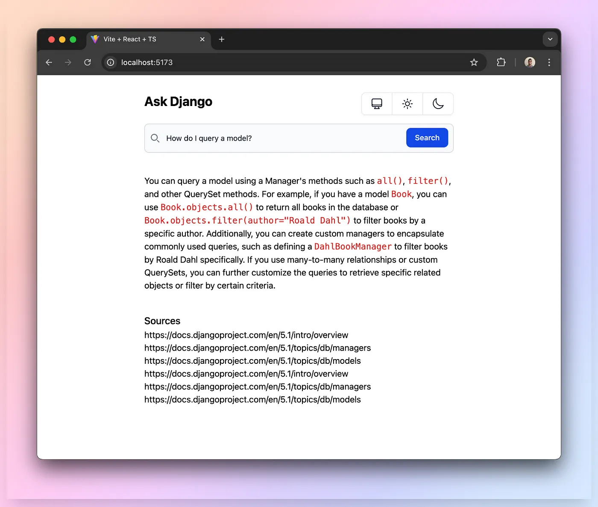

# RAG Knowledge Search

A retrieval augmented generaion (RAG) assisted chatbot-like tool. This bot answers questions specifically on the Python Django framework



Companion article: https://medium.com/@thisiskj/creating-deploying-a-knowledge-base-search-tool-60109871eb61

## Local development

Backend
```
cd web-backend
source .venv/bin/activate
export OPENAI_API_KEY=...
export CHROMA_CLIENT_AUTH_CREDENTIALS=...
hypercorn main:app --reload
```

Frontend
```
cd web-frontend
npm run dev
```